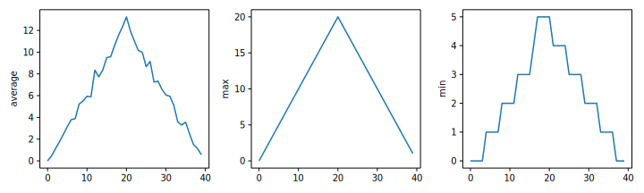

## matplotlib heatmap


## average inflammation


##  group plot



## maximum


## minimum


## Exercises

#### Plot Scaling

Why do all of our plots stop just short of the upper end of our graph?

<details>
<summary>Solution
</summary>
Because matplotlib normally sets x and y axes limits to the min and max of our data (depending on data range).
</details>

#### Update your plotting code to automatically set a more appropriate scale. (Hint: you can make use of the max and min methods to help.)

<details>
<summary>Solution
</summary>

#One method


```
axes3.set_ylabel('min')
axes3.plot(numpy.min(data, axis=0))
axes3.set_ylim(0,6)
```

</details>

<details>
<summary>Solution
</summary>

#A more automated approach


```
min_data = numpy.min(data, axis=0)
axes3.set_ylabel('min')
axes3.plot(min_data)
axes3.set_ylim(numpy.min(min_data), numpy.max(min_data) * 1.1)
```

</details>


